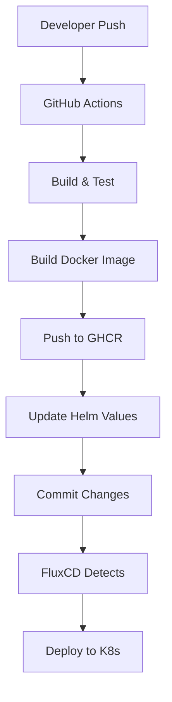

# Team A Service

A Spring Boot microservice for GitOps POC demonstrating continuous deployment with FluxCD and GitHub Packages.

## Overview

Team A Service is a sample Spring Boot application that provides REST APIs for demonstration purposes. It's designed to showcase GitOps patterns using:

- **GitHub Actions** for CI/CD
- **GitHub Container Registry** for container images
- **FluxCD** for GitOps deployments
- **Helm** for Kubernetes deployment management

## Features

- 🚀 **RESTful APIs** - Multiple endpoints for testing
- 🔍 **Health Checks** - Spring Boot Actuator integration
- 📊 **Metrics** - Prometheus metrics export
- 🛡️ **Security** - Non-root container execution
- 🏗️ **Multi-stage Build** - Optimized Docker images
- 🔄 **GitOps Ready** - Automatic deployments via FluxCD

## API Endpoints

| Endpoint | Method | Description |
|----------|--------|-------------|
| `/` | GET | Service welcome message |
| `/hello` | GET | Simple hello message |
| `/hello/{name}` | GET | Personalized greeting |
| `/api/info` | GET | Service information |
| `/api/health` | GET | Service health status |
| `/actuator/health` | GET | Spring Boot health checks |
| `/actuator/metrics` | GET | Application metrics |
| `/actuator/prometheus` | GET | Prometheus metrics |

## Local Development

### Prerequisites

- Java 17+
- Maven 3.6+
- Docker (optional)

### Running the Application

```bash
# Clone the repository
git clone https://github.com/Duggireddy-NSF/team-a-service.git
cd team-a-service

# Run with Maven
mvn spring-boot:run

# Or build and run JAR
mvn clean package
java -jar target/team-a-service-1.0.0.jar
```

The application will start on port 8080: http://localhost:8080

### Running Tests

```bash
# Run all tests
mvn test

# Run tests with coverage
mvn test jacoco:report
```

### Building Docker Image

```bash
# Build the image
docker build -t team-a-service:latest .

# Run the container
docker run -p 8080:8080 team-a-service:latest
```

## Deployment

### GitOps Deployment

The service uses GitOps for deployments:

1. **Code Push** → GitHub triggers CI/CD workflow
2. **Build & Test** → Maven builds and tests the application
3. **Container Image** → Docker image pushed to GitHub Container Registry
4. **Helm Update** → GitHub Actions updates Helm values with new image tag
5. **FluxCD Sync** → FluxCD detects changes and deploys to Kubernetes

### Manual Deployment with Helm

```bash
# Install/upgrade the service
helm upgrade --install team-a-service ./helm \
  --namespace gitops-poc \
  --create-namespace \
  --set image.tag=latest

# Check deployment status
kubectl get pods -n gitops-poc
kubectl logs -l app.kubernetes.io/name=team-a-service -n gitops-poc
```

### Configuration

Key configuration files:

- `helm/values.yaml` - Helm chart default values
- `src/main/resources/application.yml` - Spring Boot configuration
- `.github/workflows/build-deploy.yml` - CI/CD pipeline
- `Dockerfile` - Container image definition

## GitOps Architecture



## Environment Variables

| Variable | Default | Description |
|----------|---------|-------------|
| `SPRING_PROFILES_ACTIVE` | `kubernetes` | Active Spring profiles |
| `APP_VERSION` | `1.0.0` | Application version |
| `JAVA_OPTS` | `-Xmx512m -Xms256m` | JVM options |

## Monitoring

The service exposes metrics via:

- **Health Checks**: `/actuator/health`
- **Prometheus Metrics**: `/actuator/prometheus`
- **Application Info**: `/actuator/info`

Configure Prometheus to scrape metrics:

```yaml
apiVersion: v1
kind: ConfigMap
metadata:
  name: prometheus-config
data:
  prometheus.yml: |
    scrape_configs:
      - job_name: 'team-a-service'
        kubernetes_sd_configs:
          - role: pod
        relabel_configs:
          - source_labels: [__meta_kubernetes_pod_annotation_prometheus_io_scrape]
            action: keep
            regex: true
```

## Security

Security features implemented:

- ✅ **Non-root user** - Container runs as user `appuser` (UID 1001)
- ✅ **Read-only filesystem** support
- ✅ **Security contexts** - Kubernetes security policies
- ✅ **Vulnerability scanning** - Trivy security scans in CI/CD
- ✅ **Secrets management** - GitHub Packages authentication
- ✅ **Network policies** - Kubernetes network isolation (when enabled)

## Troubleshooting

### Common Issues

**Service not starting:**
```bash
# Check pod logs
kubectl logs -l app.kubernetes.io/name=team-a-service -n gitops-poc

# Check events
kubectl get events -n gitops-poc --sort-by=.metadata.creationTimestamp
```

**Image pull errors:**
```bash
# Check image pull secret
kubectl get secret github-packages-secret -n gitops-poc -o yaml

# Test image pull manually
docker pull ghcr.io/myorg/team-a-service:latest
```

**Health check failures:**
```bash
# Test health endpoint locally
curl -f http://localhost:8080/actuator/health

# Check readiness/liveness probes
kubectl describe pod <pod-name> -n gitops-poc
```

### Debug Mode

Enable debug logging:

```yaml
# In Helm values.yaml
env:
  - name: LOGGING_LEVEL_COM_EXAMPLE_TEAMA
    value: DEBUG
```

## Contributing

1. Fork the repository
2. Create a feature branch: `git checkout -b feature/amazing-feature`
3. Make changes and add tests
4. Commit changes: `git commit -m 'Add amazing feature'`
5. Push to branch: `git push origin feature/amazing-feature`
6. Create Pull Request

## CI/CD Pipeline

The GitHub Actions workflow includes:

- ✅ **Unit Tests** - Maven test execution
- ✅ **Code Quality** - Test reporting
- ✅ **Security Scan** - Trivy vulnerability scanning
- ✅ **Image Build** - Multi-platform Docker builds
- ✅ **Registry Push** - GitHub Container Registry
- ✅ **GitOps Update** - Automatic Helm values update
- ✅ **Deployment** - FluxCD automatic deployment

## License

This project is part of the GitOps POC and is intended for demonstration purposes.

## Team

**Team A** - Microservices Development Team

For questions or support, please contact the Team A development team.

---

*Generated as part of GitOps Pipeline Architecture POC*
